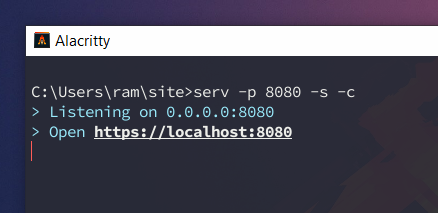

# serv

A development server for serving static files.



## Installation

``` bash
$ npm install --global @ramlmn/serv

# or

$ git clone https://github.com/ramlmn/serv.git && cd serv
$ npm install && npm link
```
Try `sudo` with `npm link` if it fails.

**Note:** Windows users, get OpenSSL from
[https://slproweb.com/products/Win32OpenSSL.html](https://slproweb.com/products/Win32OpenSSL.html)

## Usage

### From terminal
``` bash
$ serv --dir path/to/dir/ --port 8080
```

Use `--help` for help and examples.
#### Flags

Flag                | Default   | Description
--------------------|-----------|-----------------------------------------------
 `-d`, `--dir`      | `.`       | Relative path to directory to serve
 `-p`, `--port`     | `8080`    | Port to listen on
 `-c`, `--compress` | `false`   | Enable compression or not
 `-l`, `--listing`  | `false`   | Enable directory listing
 `-s`, `--secure`   | `false`   | Create a secure version of the server
 `-h2`, `--http2`   | `false`   | Run a `h2` server
 `-f`, `--fast`     | `false`   | Fast mode(no compression/ETags/logging)

**Note:** Currently no browser supports http2 without TLS, `-h2` currently is
worthy only when used with `-s`
[(ref)](https://nodejs.org/api/http2.html#http2_server_side_example)

### From Node API

``` js
const Serv = require('@ramlmn/serv');

// Options for Serv
const options = {
  dir: 'path/to/dir/',
  port: 8080,
  compress: true,
  listing: false,
  secure: true,
  http2: true,
  fast: false,
  logger: (request, response) => {
    // Log `request` and `response` or whatever
  },
}

// Create instance of Serv
const staticServer = new Serv(options);

// Start server
try {
  const server = await staticServer.start();
  console.log('Server Started');
  console.log('With config: ', staticServer.options);
  // {
  //   dir: ...,
  //   port: ...,
  //   ...,
  //   certs: {         <- certs used are exposed, if secure only
  //     key: ...,
  //     certs: ...
  //   }
  // }
} catch (err) {
  console.error('Failed: ', err);
}

// For stopping
server.stop();
```

## License
[MIT](LICENSE)
